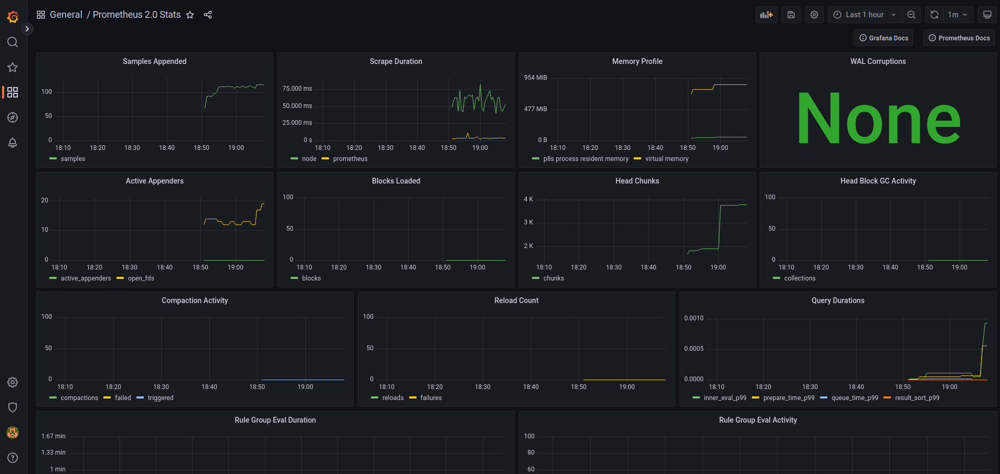

# Simple Server Monitoring Environment

## Tech Stack

* Grafana
* Prometheus

## Setup

0. `git clone <this_repository> && cd <this_repository>`
1. `vagrant up`
2. Access 'http://localhost:3000/' on browser
3. Login by using 'admin:secret'
4. Add 'Prometheus' as data source
5. Input 'http://192.168.56.31:9090/' in URL field on HTTP section
6. Utilize 'Prometheus 2.0 Stats' to view dashboards and you can see like pic below

## Grafana Memo

* Used Port
  * 3000: Web UI

## Prometheus Memo

* Where config directory
  * `/etc/prometheus/`
  * `/etc/alertmanager/`
* Used Port
  * 9090: Prometheus Default UI
  * 9100: Node Exporter
